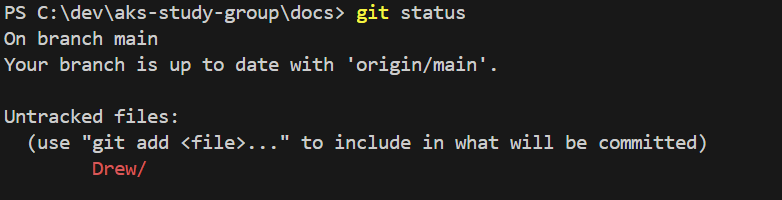
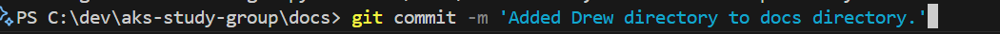
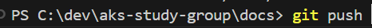
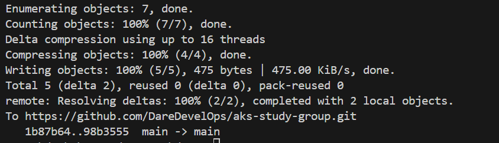

# Git Basics

## Basic workflow

After you've cloned a repo there are several basic commands to learn.
all commands are prefaced with git.

```powereshell
git --help or git -h to list commands, sub-commands and command aruguments.
```

After you've made changes to the code there is a three part process to update the repo.

```powershell
git add modifed files to be tracked
git commit -m ' Add a message to detail the changes you are making.'
git push
```

### Excercise

1. Create a folder under the docs folder in this repo with your name.

2. add a readme.md file to the folder and add some text to it and maybe a  level 1 heading.

3. run `git status` command you should see


4. Run git add command to add the directory and files for git project tracking.


5. Run git commit to add a commit message.


6. Push commit to remote repo.


7. Git push success.



