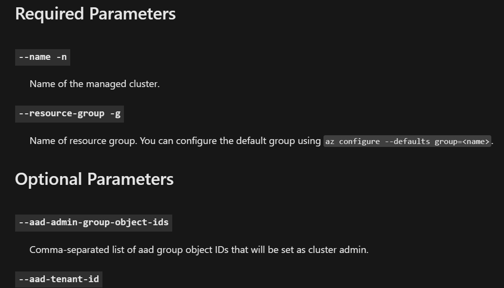

# Module 1 Guide - Create a basic AKS cluster and deploy simple app

## Excercise Create a Basic Azure Kubernetes Service (AKS) Cluster

### Task 1 Login to your subscription

1. Open a Windows Terminal session (defaults to PowerShell)
2. Login to Azure

```powershell
        az login
```

3. Set the subscription you want to work in

```powershell
    az account set --subscription <subscription name>
```

4. Register required providers

```powershell
az provider register --namespace <provider name>
```

5. Open a browser session to the Azure portal 

6. Search for subscription tab open the desired subscription

7. Watch the progress of the provider registration or run the verification script included in the repository scripts directory

### Task 2 - Define Variables and create resource group

    When creating variables refer to the resource command to determine which variables are required. These will be your global variables. Typicaly optional parameters are enclosed in square brackets, required paramters are not.

    for the az aks create command the name and resource group parameters are the only required parameters. All other parameters are optional. The required and optional parameters are usually defined after the examples.


Typical varibles are 

- Resource Region common variable is $location. think about where your potential users are located or what the overall cloud architecture is.

- 

1. Select region at
2. Define global variables

